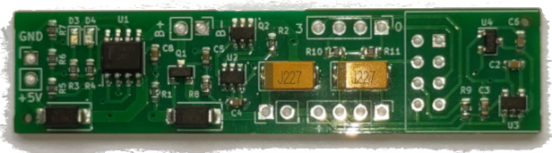
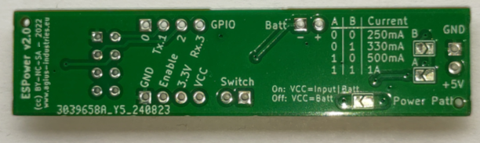

# ESPower

ESPower is a motherboard for ESP8266-01 with voltage regulator, voltage protection and Li-Ion battery charger integrated. 

It has been designed to run off intermittent 5V USB power supply but it can also be powerred by a small 6V Solar panels. Low power consumption has been kept in mind.

The narrow form factor has been designed to be embedded in small upcycled objects like used glass bottles.

## Features

- Li-Ion battery charger with battery protection (TP4056).
- Intensity of battery recharge can be selected between 250mA and 1A with solder jumpers.
- Power path to select if the board is always powered by the battery or is also powered by VCC when an external power supply is provided.
- Voltage detector to properly switch off the ESP8266 when the battery voltage is too low for proper operation. This prevent crashes of the ESP when the battery is drained.
- Voltage detector signal is exported so it can be used by any attached components, like boost-buck converters to shut them down if the battery voltage is too low.

## Manufacturing

See directory `Gerber/` for production files and bill of materials.

## Versions

Version 2 has been slightly improved with a smaller form-factor, Tantalum capacitors to reduce thickness and pull-up resistors on GPIOs to ensure proper boot of the ESP.

## License 

Copyleft 2022 - Nicolas AGIUS - GNU GPLv3

